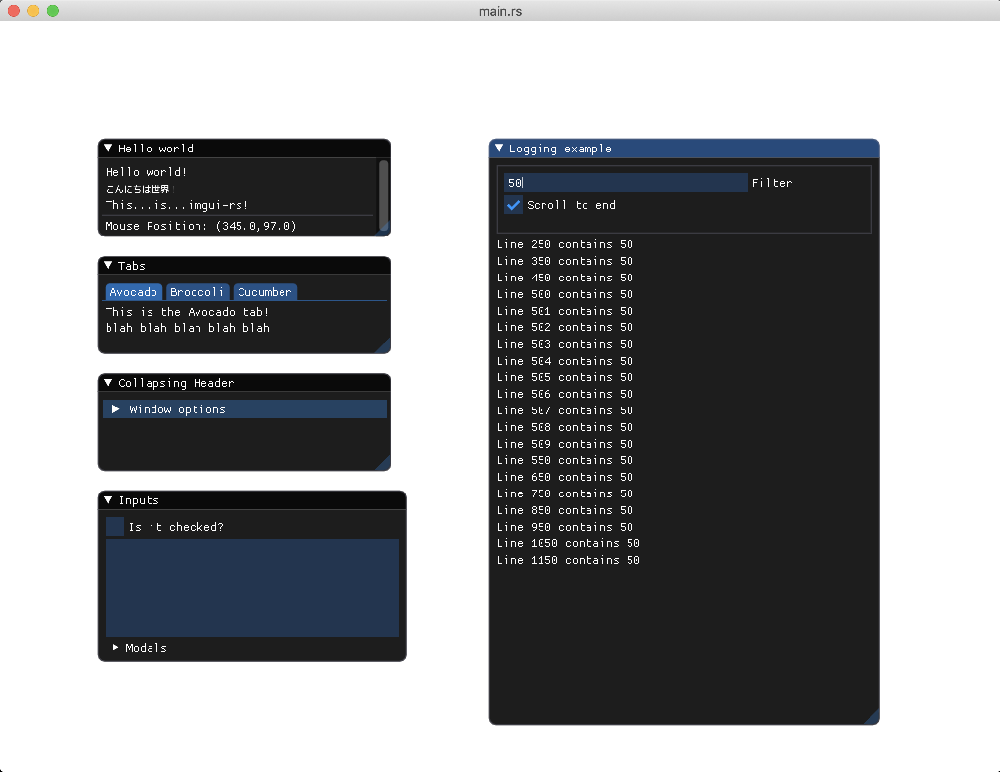

# imgui-rs-example

Displays a basic window with [imgui-rs](https://github.com/Gekkio/imgui-rs) GUI elements.

This is mostly derived from [imgui-rs](https://github.com/Gekkio/imgui-rs) examples but you will also find examples on how to:

- Use ImGuiListClipper to clip a large list of evenly spaced items to avoid processing on items that will not be visible on the list.
- 'Scroll to bottom' on a list of items.

#### Screenshots

